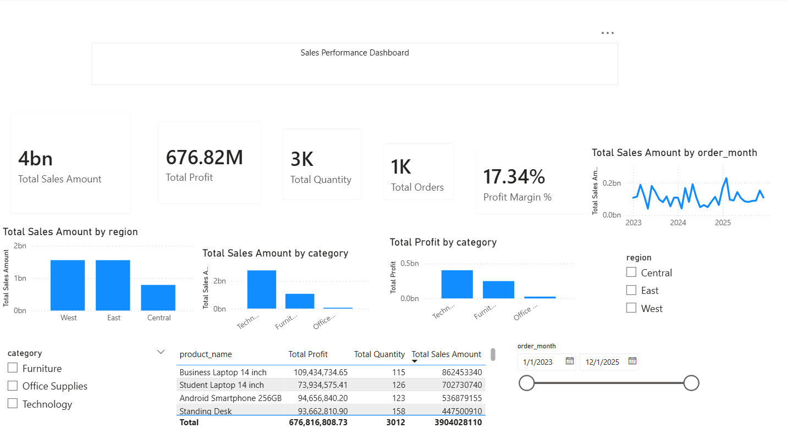

# Sales Performance Analysis

## Project Overview

This project analyzes retail sales performance using transaction data. The analysis focuses on identifying sales trends, category performance, regional performance, top-performing products, and profitability risks.

The goal of this project is to demonstrate an end-to-end data analysis workflow, starting from data checking and preparation, exploratory analysis, SQL analysis, dashboard development, and business insight reporting.

## Business Problem

The business wants to understand overall sales performance and identify which categories, regions, and products contribute the most to sales and profit.

This analysis also aims to answer whether high sales always lead to high profit and whether discount strategy may affect profitability.

## Dataset

The dataset contains 1,000 retail sales transaction records. Each transaction includes information such as:

- Order date
- Customer segment
- City and province
- Region
- Category and sub-category
- Product name
- Quantity
- Unit price
- Discount
- Sales
- Cost
- Profit
- Payment method
- Order month
- Shipping days
- Profit margin

## Tools Used

- Microsoft Excel
- MySQL
- Power BI
- GitHub

## Analysis Process

1. Checked missing values and data quality using Excel.
2. Added supporting columns such as `order_month`, `shipping_days`, and `profit_margin`.
3. Created pivot tables to explore sales and profit patterns.
4. Used MySQL to validate and analyze key business metrics.
5. Built a Power BI dashboard to visualize sales performance.
6. Created a business insight report with findings and recommendations.

## Key Metrics

| Metric | Value |
|---|---:|
| Total Sales | 3,904,028,110 |
| Total Profit | 676,816,808.73 |
| Total Quantity | 3,012 |
| Total Orders | 1,000 |
| Profit Margin | 17.34% |

## Dashboard Preview

## Key Insights

1. Technology is the strongest category, generating the highest total sales and profit.
2. Office Supplies has a high quantity sold, but lower total sales because the products have relatively lower prices.
3. West has the highest sales, while East generates higher profit, showing that higher revenue does not always mean higher profitability.
4. Business Laptop 14 inch is the top product by both sales and profit.
5. Some transactions have negative profit, indicating potential risks from high discount or high cost.
6. High-discount transactions need to be monitored because they can reduce profit margin.

## Business Recommendations

1. Prioritize the Technology category because it contributes the most sales and profit.
2. Maintain stock availability for top-performing products such as Business Laptop 14 inch.
3. Monitor discount strategy to avoid reducing profit margin.
4. Analyze regional profitability, not only regional sales.
5. Use monthly sales trends to plan future campaigns and stock preparation.
6. Use Office Supplies as supporting products or bundle them with higher-value products.

## Project Files

| Folder | Description |
|---|---|
| `dataset/` | Contains the cleaned dataset and Excel working file. |
| `sql/` | Contains SQL queries used for analysis. |
| `dashboard/` | Contains the Power BI dashboard file and dashboard screenshot. |
| `report/` | Contains the business insight report. |

## Files Included

- `dataset/cleaned_sales_performance_dataset.csv`
- `dataset/file + pivot.xlsx`
- `sql/analysis.sql.txt`
- `dashboard/sales_dashboard.pbix`
- `dashboard/dashboard_screenshot.png`
- `report/business_insight_report.pdf`

## Conclusion

This project shows how sales transaction data can be analyzed to identify business performance, product contribution, regional profitability, and potential profit risks. The analysis helps support better decision-making related to product strategy, discount control, campaign planning, and profitability improvement.